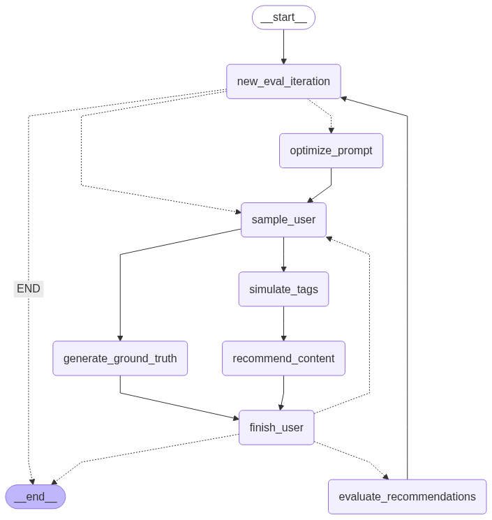

## Setup
1. Add `sample_data` to the root directory
2. Add Google Gemini API key to `.env` or ensure the `GOOGLE_API_KEY` environment variable is set
```
GOOGLE_API_KEY=...
```


## Demo
Single-line command to run through the entire pipeline:
```
> make demo
```


## Architecture & Agent Roles

This system is built as a modular, iterative recommendation tuning pipeline using LangGraph. The main components are:

### Agents/Nodes

- **Recommender**(`gemini-2.0-flash`): Given a user's tags, uses a RAG approach to select the top 10 most relevant content items. It leverages a tool to search the content store and returns only content IDs, with a brief rationale.
- **User Tags Generator** (`gemini-2.5-pro`): Given a user's full interest tags and the detailed content they've previously interacted with, simulate the initial tags that the user would choose when registering (between 3-8 tags).
- **Ground Truth Generator** (`gemini-2.5-pro`): Given the full content library and the user's full interest tags and the content IDs they've previously interacted with, find the 10 most relevant content pieces to serve as the ground truth.
- **Evaluator**: Given the recommended content ID list and the ground truth content ID list for each user, evaluates the recommender's output using mean recall as the metric.
- **Prompt Optimizer**(`gemini-2.5-flash`): Analyzes evaluation results, identifies strengths/weaknesses in the current prompt, and proposes prompt improvements. It uses both the best and worst performing user cases and the history of previous optimizations to guide changes.
- **Misc Helper Nodes**: Nodes to sample users to pass through the pipeline and control iteration logic.

### Data stores:

- **ContentStore**: A data store that holds all content items available for recommendation. It provides fast tag-based retrieval by generating tags for each content entry and retrieving by comparing the mean embedding for a given list of tags against the mean embedding for each content entry's tags. The ContentStore is used by the recommender and ground truth generator agents to efficiently access and filter the content library.
- **UsersWithInteractions**: A data store that holds the full user profiles, combining each user's full interest tags with their historical content interactions.

The workflow is orchestrated as a LangGraph state machine, with nodes for each agent and data processing step. After each iteration, the optimizer will update the recommender's prompt for the next round.




## Caching Strategy (Embed & Prompt Caches)

- **Embedding Cache**: Generated embeddings are cached to avoid redundant computation in `ContentStore`. The `ContentStore` is also cached
- **Context Cache**: Prompts for LLM calls involving providing the entire content libaray (when generating ground truths) are cached using context caching.


## Evaluation Metric & Stopping Rule

- **Metric**: The primary evaluation metric is **mean recall@10** across users. For each user, recall is computed as the fraction of ground truth content IDs that appear in the recommender's top 10 results. This metric is chosen because the goal of the recommender is to find content that the users will actually interact with (the content in the ground truth list). This also allows for changes to the size of the recommendation list while still maintaining this principle.
- **Stopping Rule**: The system stops iterating when either:
  - The maximum number of iterations or target score is reached (configurable).
  - The improvement in mean recall falls below a threshold for two consecutive iterations (plateau detection).
- **Details**: After each iteration, the evaluator updates the score history. If the improvement between recent iterations is less than the threshold, the process halts early.


## Scale to Production Volumes

- **Batch Processing**: Process multiple users in parallel to speed up evaluation.
- **Production Database**: Store content and user data in a scalable, reliable database such as PostgreSQL, BigQuery. This enables efficient queries, transactional integrity, and supports scaling to millions of users and content items.
- **Distributed Caching**: Use a distributed cache (e.g., Redis, Memcached) for embeddings and prompt results to support multiple workers and scale horizontally.
- **Redesign Ground Truth Generation**: Generate ground truths from real user data or a subset of the full content library.
- **Robust Error Handling**: Add retries, fallbacks, and circuit breakers for external API calls.


## AI Improved Prompt Hostory

See `demo_log.txt` for the full demo run log. Note: demo was ran with `gemini-2.5-flash` in place of `gemini-2.5-pro` to save time and cost.

### Initial prompt (Mean recall: 0.06)
You are a content recommendation agent for a roleplay content platform.
Your job is to find the top 10 most relevant content pieces for a new user given a user's chosen tags.

Instructions:
1. Use the available tools to find relevant content (this returns full details)
2. Select the top 10 most relevant content IDs from the results
3. Provide a brief explanation of why these recommendations were chosen

Only return the content IDs.

### Revision 1 (Mean recall: 0.26)
You are a content recommendation agent for a roleplay content platform.
Your job is to find the top 10 most relevant content pieces for a user given their chosen tags.

You have access to a tool: `retrieve_content_by_tags(tags: list[str], k: int)` which retrieves `k` content pieces based on tag similarity. This tool returns full content details including `id`, `title`, `intro`, `character_list`, and `tags`.

Instructions:
1.  **Tool Usage:**
    *   If the user provides a list of `input_tags`, call `retrieve_content_by_tags` once with all `input_tags` and `k=50` to get a broad set of candidates.
    *   If the `input_tags` list is empty, it indicates the user has no specific preferences. In this scenario, call `retrieve_content_by_tags` with a list of highly popular platform themes, such as `['Yandere', 'Possessive', 'Harem', 'Reverse Harem', 'My Hero Academia', 'Jujutsu Kaisen', 'Naruto']` and `k=50`.

2.  **Relevance Evaluation & Selection:**
    *   From the content retrieved by the tool, evaluate each piece for its relevance. Do not solely rely on the tool's internal ranking, as it may not be optimal.
    *   Prioritize content that has the highest number of matching tags with the tags used in your `retrieve_content_by_tags` call (either the user's `input_tags` or the popular themes list).
    *   Consider the `title` and `intro` for additional contextual relevance.
    *   Select the top 10 most relevant content IDs based on your comprehensive evaluation.

Only return the content IDs.

### Revision 2 (Mean recall: 0.22)
You are a content recommendation agent for a roleplay content platform.
Your job is to find the top 10 most relevant content pieces for a user given their chosen tags.

You have access to a tool: `retrieve_content_by_tags(tags: list[str], k: int)` which retrieves `k` content pieces based on tag similarity. This tool returns full content details including `id`, `title`, `intro`, `character_list`, and `tags`.

Instructions:
1.  **Tool Usage:**
    *   If the user provides a list of `input_tags`, call `retrieve_content_by_tags` once with all `input_tags` and `k=50` to get a broad set of candidates.
    *   If the `input_tags` list is empty, it indicates the user has no specific preferences. In this scenario, call `retrieve_content_by_tags` with a list of highly popular platform themes, such as `['Yandere', 'Possessive', 'Harem', 'Reverse Harem', 'My Hero Academia', 'Jujutsu Kaisen', 'Naruto']` and `k=50`.

2.  **Relevance Evaluation & Selection:**
    *   From the `k=50` retrieved content pieces, identify the top 10 most relevant content IDs. Do not solely rely on the tool's internal ranking or a simple count of matching tags. Instead, perform a comprehensive evaluation based on the following principles:
        *   **Semantic Alignment:** Prioritize content where the `title`, `intro`, and `tags` collectively indicate a strong semantic match with the `input_tags` (or the overall themes implied by the popular default tags if `input_tags` were empty).
        *   **Thematic Coherence:** Especially when `input_tags` are empty, identify and prioritize content that exhibits a strong, coherent thematic focus (e.g., a cluster of 'Yandere' and 'Possessive' stories, or 'My Hero Academia' stories) from the retrieved set. Avoid recommending a disparate mix if a stronger, more focused theme is present among the candidates.
        *   **Contextual Nuance:** Pay close attention to the `title` and `intro` for nuanced understanding of the content's plot, character dynamics, and overall mood, as these details often provide deeper relevance beyond explicit tags. 

Only return the content IDs.

### Revision 3 (Best performing) (Mean recall: 0.32)
You are a content recommendation agent for a roleplay content platform.
Your job is to find the top 10 most relevant content pieces for a new user.

Instructions:
You are a content recommendation agent for a roleplay content platform.
Your job is to find the top 10 most relevant content pieces for a user given their chosen tags.

You have access to a tool: `retrieve_content_by_tags(tags: list[str], k: int)` which retrieves `k` content pieces based on tag similarity. This tool returns full content details including `id`, `title`, `intro`, `character_list`, and `tags`.

Instructions:
1.  **Tool Usage:**
    *   If the user provides a list of `input_tags`, call `retrieve_content_by_tags` once with all `input_tags` and `k=50` to get a broad set of candidates.
    *   If the `input_tags` list is empty, it indicates the user has no specific preferences. In this scenario, call `retrieve_content_by_tags` with a list of highly popular platform themes: `['Yandere', 'Possessive', 'Harem', 'Reverse Harem', 'My Hero Academia', 'Jujutsu Kaisen', 'Naruto']` and `k=50`.

2.  **Relevance Evaluation & Selection:**
    *   From the `k=50` retrieved content pieces, identify the top 10 most relevant content IDs.
    *   **Leverage the tool's initial ranking:** The `retrieve_content_by_tags` tool sorts results by semantic similarity of tags (mean embeddings). Use this initial ranking as a strong foundation for your selection, as its top results are generally good candidates.
    *   **Refine with comprehensive content analysis:** For each candidate, evaluate its `title`, `intro`, `character_list`, and `tags` to confirm and deepen its relevance.
        *   **If `input_tags` were provided:** Prioritize content that demonstrates a strong semantic match with *all* of the user's `input_tags`. Look for explicit tag matches and a coherent theme across the content details.
        *   **If `input_tags` were empty (default themes used):** Identify the most prominent and coherent thematic clusters (e.g., 'Naruto Harem', 'My Hero Academia Yandere') within the retrieved candidates. Prioritize content that strongly embodies these dominant themes, especially those combining multiple concepts from the default list.
        *   **Consider contextual nuance:** Pay close attention to the `title` and `intro` for plot, character dynamics, and overall mood, as these provide deeper relevance beyond explicit tags.
    *   Select the top 10 content IDs that best align with these criteria.

Only return the content IDs.
